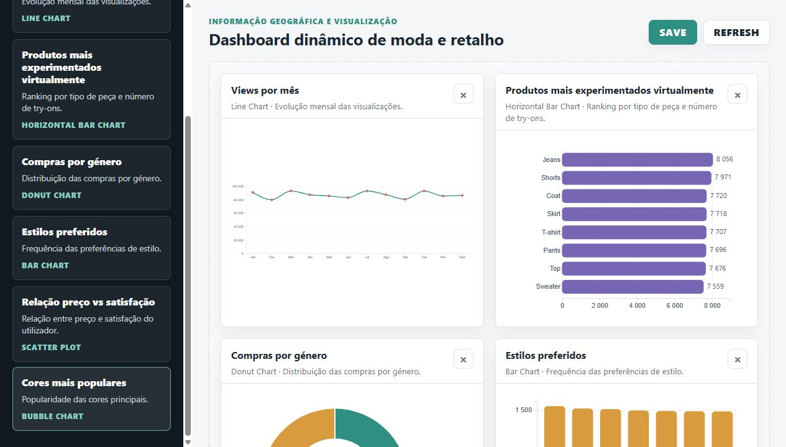

# Fashion Analytics Dashboard

Dashboard interativo para exploração e visualização de dados de moda e retalho, desenvolvido com **D3.js**. O projeto permite analisar preferências, interações, compras e indicadores de experiência presentes num dataset local.

Este trabalho foi desenvolvido no contexto da unidade curricular de **Informação Geográfica e Visualização**.



## Objetivo

O objetivo do projeto é transformar um conjunto de dados de moda numa experiência visual clara e personalizável. O utilizador pode escolher as métricas que pretende analisar, adicionar gráficos ao painel e reorganizá-los através de drag-and-drop.

## Funcionalidades

- Carregamento e processamento de dados a partir de um ficheiro CSV local.
- Resumo geral com número de registos, utilizadores, engagement, compras e satisfação média.
- Catálogo com 12 métricas disponíveis para análise.
- Adição de gráficos por drag-and-drop ou através do teclado.
- Reorganização e remoção dos gráficos do dashboard.
- Tooltips interativos com informação adicional.
- Atualização dos dados sem recarregar a página.
- Persistência da configuração do dashboard no `localStorage` do navegador.
- Layout responsivo para diferentes dimensões de ecrã.

## Visualizações disponíveis

| Métrica | Tipo de gráfico | Análise |
| --- | --- | --- |
| Views por mês | Série temporal | Evolução mensal das visualizações |
| Peças mais experimentadas | Barras horizontais | Categorias com mais utilizações do provador virtual |
| Compras por género | Donut | Distribuição das compras por género |
| Estilos preferidos | Barras | Frequência das preferências de estilo |
| Preço e satisfação | Dispersão | Relação entre o preço e a satisfação |
| Cores mais populares | Bolhas | Frequência das cores principais |
| Likes por mês | Série temporal | Evolução mensal dos likes |
| Engagement por estilo | Barras horizontais | Soma de likes, partilhas e itens guardados por estilo |
| Compras por orçamento | Donut | Distribuição das compras por nível de orçamento |
| Preço médio por marca | Barras horizontais | Comparação do preço médio entre marcas |
| Scores de experiência | Barras | Médias de satisfação, conforto, qualidade, fit e sustentabilidade |
| Sustentabilidade por tecido | Barras horizontais | Comparação do score médio de sustentabilidade por tecido |

## Dataset

O ficheiro `data/fashion_dataset_complete.csv` contém **10 500 registos** relacionados com utilizadores, produtos e interações. Entre as variáveis disponíveis encontram-se:

- dados demográficos e preferências de estilo;
- marca, tipo de peça, tecido, cor e padrão;
- ocasião, estação do ano e condições meteorológicas;
- preço e scores de satisfação, conforto, qualidade, fit e sustentabilidade;
- views, likes, partilhas, itens guardados, experiências virtuais e compras.

Os dados são convertidos e agregados diretamente no navegador através das funções disponibilizadas pelo D3.js.

## Tecnologias

- HTML5
- CSS3
- JavaScript
- D3.js v7
- Web Storage API (`localStorage`)

Não é necessário instalar dependências: a biblioteca D3.js está incluída localmente no projeto.

## Como executar

O dashboard deve ser aberto através de um servidor HTTP local, uma vez que o navegador pode bloquear o carregamento direto do ficheiro CSV.

### Windows

Executar o ficheiro:

```text
start-dashboard.bat
```

Depois, abrir no navegador:

```text
http://localhost:8000
```

### Terminal

Também é possível iniciar manualmente um servidor com Python:

```bash
python -m http.server 8000
```

Em algumas instalações do Windows, o comando é:

```bash
py -m http.server 8000
```

## Como utilizar

1. Iniciar o servidor local e abrir `http://localhost:8000`.
2. Arrastar uma métrica da barra lateral para a área principal.
3. Passar o cursor sobre os elementos dos gráficos para consultar os detalhes.
4. Arrastar os cartões para alterar a sua ordem ou usar o botão `×` para os remover.
5. Selecionar **GUARDAR** para manter a configuração no navegador.
6. Selecionar **ATUALIZAR** para voltar a carregar os dados do CSV.

## Estrutura do projeto

```text
fashion-dashboard-d3/
├── data/
│   └── fashion_dataset_complete.csv
├── d3.v7.min.js
├── dashboard-preview.png
├── index.html
├── script.js
├── start-dashboard.bat
├── style.css
└── README.md
```

## Autoria

**Letícia Loureiro**

